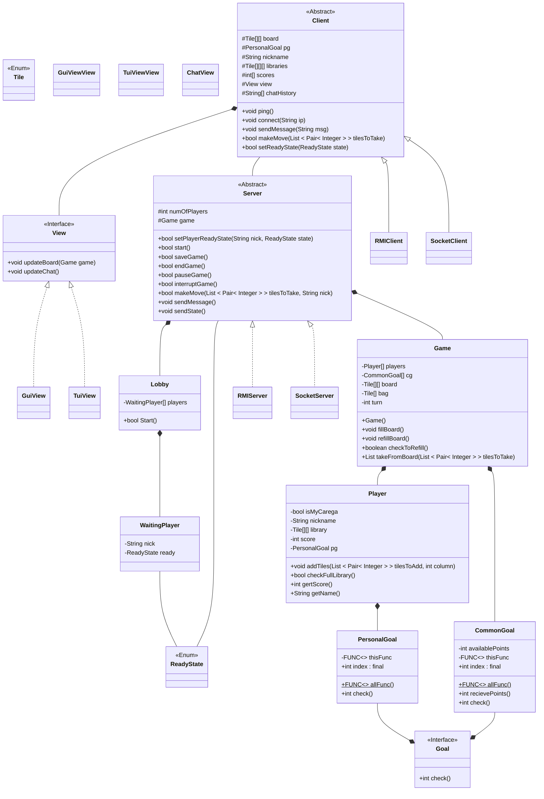

```mermaid
classDiagram

Player *-- PersonalGoal

Game *-- Player

Game *-- CommonGoal

  

class Goal {

<<Interface>>

+int check()

}

CommonGoal --* Goal

class CommonGoal {

+FUNC<> allFunc()$

-int availablePoints

-FUNC<> thisFunc

+int recievePoints()

+int index : final

+int check()

}

  

PersonalGoal --* Goal

class PersonalGoal {

+FUNC<> allFunc()$

-FUNC<> thisFunc

+int index : final

+int check()

}

  

class Player {

-bool isMyCarega

-String nickname

-Tile[][] library

-int score

-PersonalGoal pg

+void addTiles(List < Pair< Integer > > tilesToAdd, int column)

+bool checkFullLibrary()

+int gertScore()

+String getName()

}

  

class Tile {

<<Enum>>

}

  

class Game {

-Player[] players

-CommonGoal[] cg

-Tile[][] board

-Tile[] bag

-int turn

+Game()

+void fillBoard()

+void refillBoard()

+boolean checkToRefill()

+List<Tile> takeFromBoard(List < Pair< Integer > > tilesToTake)

}

Server *-- Lobby

  

class Server {

<<Abstract>>

#int numOfPlayers

#Game game

+bool setPlayerReadyState(String nick, ReadyState state)

+bool start()

+bool saveGame()

+bool endGame()

+bool pauseGame()

+bool interruptGame()

+bool makeMove(List < Pair< Integer > > tilesToTake, String nick)

+void sendMessage()

+void sendState()

}

  

Server -- ReadyState

WaitingPlayer -- ReadyState

class ReadyState {

<<Enum>>

}

  

Server <|.. RMIServer

class RMIServer {

  

}

  

Server <|.. SocketServer

class SocketServer {

  

}

  

class WaitingPlayer {

-String nick

-ReadyState ready

}

  

Server *-- Game

Lobby *-- WaitingPlayer

class Lobby {

-WaitingPlayer[] players

+bool Start()

}

  
  

class View {

<<Interface>>

  

+void updateBoard(Game game)

+void updateChat()

}

  

View <|.. GuiView

class GuiView View{

  

}

  

View <|.. TuiView

class TuiView View {

  

}

  
  

class ChatView {

  

}

  

Client *-- View

Client -- Server

class Client {

<<Abstract>>

#Tile[][] board

#PersonalGoal pg

#String nickname

#Tile[][][] libraries

#int[] scores

#View view

#String[] chatHistory

+void ping()

+void connect(String ip)

+void sendMessage(String msg)

+bool makeMove(List < Pair< Integer > > tilesToTake)

+bool setReadyState(ReadyState state)

}

  

Client <|-- RMIClient

class RMIClient {

  

}

Client <|-- SocketClient

class SocketClient {

  

}

```